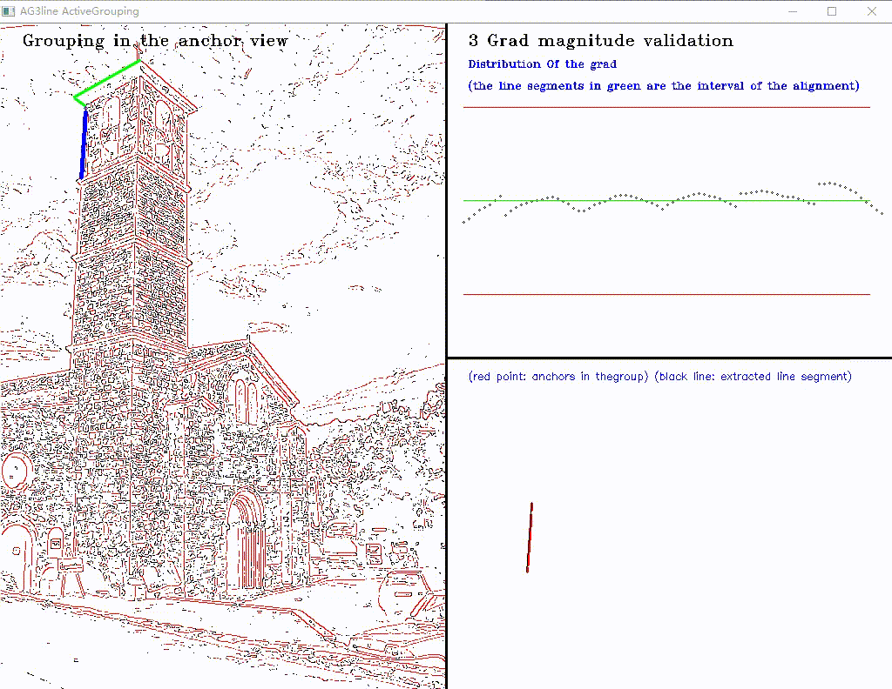

# AG3line:Active Grouping and Geometry-Gradient Combined Validation for Fast Line Segment Extraction

## Introduction
1. This is the C++ implementation of the proposed line segment detector named AG3line: "Active Grouping and Geometry-Gradient Combined Validation for Fast Line Segment Extraction". Note that the codes rely on OpenCV 2.4 and was successfully compiled with VS2010.
2.  The folder "pic" contains 5 images for experiment, and other 102 images can be found on the [website](http://www.elderlab.yorku.ca/resources/york-urban-line-segment-database-information/), the York Urban database.  
3. The experimental results of AG3line, [LSD](http://www.ipol.im/pub/art/2012/gjmr-lsd/), [Linelet](https://github.com/NamgyuCho/Linelet-code-and-YorkUrban-LineSegment-DB), [EDLines](http://ceng.anadolu.edu.tr/cv/EDLines/) , [MCMLSD](http://www.elderlab.yorku.ca/resources/) and [PPHT](https://docs.opencv.org/2.4/modules/imgproc/doc/feature_detection.html?highlight=houghlinesp#houghlinesp) on the York Urban database are saved in folder "YorkUrbanRes", and the comparing of the extraction result can be plotted by the code in "YorkUrbanRes\seeres.m".  
4. Based on the extraction results and ground truth, the performances of the six detectors can be evaluated by the code in 'EvaluationDemo.m'.  
## 5. An exe demo is available in the "Demo" folder to show the grouping process of our algorithm.

## Some results
Some experimental results are listed below. In addition, the results of other 102 images in York Urban databse are saved in "YorkUrbanRes" and they can be ploted by the code in "YorkUrbanRes\seeres.m". 

|||||
|:----:|:----:|:----:|:----:|
| ||||
|image| PPHT | LSD | EDLines |
|||||
|| Linelet | MCMLSD |***AG3line***|
|||||
|image| PPHT | LSD | EDLines |
|||||
|| Linelet | MCMLSD |***AG3line***|
|||||
|image| PPHT | LSD | EDLines |
|||||
|| Linelet | MCMLSD | ***AG3line*** |
|||||
|image| PPHT | LSD | EDLines |
|||||
|| Linelet | MCMLSD | ***AG3line*** |
|||||
|image| PPHT | LSD | EDLines |
|||||
|| Linelet | MCMLSD | ***AG3line*** |

